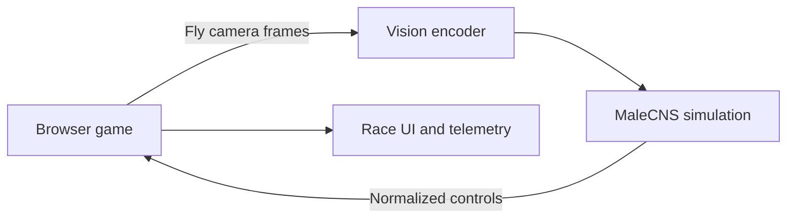

# Fly vs. Human Racing Game

## Product Requirements Document

**Status:** Draft 1  
**Date:** 20 September 2026  
**Platform:** Web  
**Working title:** Fly Racer

---

## 1. Product Summary

Fly Racer is a browser-based 3D racing experiment in which a human races against a car controlled by a simplified simulation based on the mapped nervous system of a male fruit fly.

The experience should be understandable as both a game and a scientific toy. The human drives normally, while the fly-controlled car receives visual input from cameras mounted on its vehicle. Those visual signals enter a neural simulation based on the MaleCNS connectome, and selected neural activity is translated into steering, throttle, braking, and potentially recovery actions.

The first goal is not to create a strong racing AI. It is to demonstrate a real, inspectable loop:

> Track image → simulated fly vision → connectome activity → vehicle controls → changed track image

The initial product succeeds when a player can open a web page, race the fly, and see convincing evidence that changes in the fly’s visual input affect its driving.

---

## 2. Background

### 2.1 MaleCNS connectome

The MaleCNS project maps the nervous system of a male fruit fly, including the brain, ventral nerve cord, and connections between them. Its published data includes neuron annotations, connection strengths, predicted neurotransmitters, and 3D neuron structures.

A connectome is a wiring map, not a functioning digital brain. To make it behave, an implementation must add assumptions about neuron dynamics, sensory encoding, timing, motor output, and—if desired—learning.

Resources:

- [MaleCNS project overview](https://www.janelia.org/project-team/flyem/male-cns-connectome)
- [MaleCNS dataset downloads](https://male-cns.janelia.org/download/)

### 2.2 Fly64 reference project

[Fly64](https://github.com/ornata/fly) demonstrates how the fly’s measured wiring can control a game character. It:

1. Captures game images from cameras placed around the character’s eye level.
2. Converts those images into simplified light, colour, and motion signals for simulated visual cells.
3. Propagates activity through the biological connection graph using simplified neuron dynamics.
4. Maps selected descending-neuron activity to game controls.

Its documented mappings include forward movement from DNg100 activity, steering from right–left differences in DNa02/DNg13, and jumping from bursts in DNp01/DNp10. It runs the simulation at approximately 50 steps per second on the referenced local hardware.

Fly64 does not train the fly or give it a reward or goal. It can therefore move without understanding the game and may repeatedly hit obstacles. Fly Racer should preserve this distinction in its UI and positioning.

---

## 3. Product Goals

### 3.1 Primary goals

- Let one human race against one fly-controlled car in a browser.
- Build an observable, low-latency loop from the fly car’s vision through the neural simulation to vehicle controls.
- Make the fly’s perception and control output visible enough that players understand what is happening.
- Deliver a polished arcade-racing presentation using reusable 3D assets and established vehicle physics.
- Make the architecture suitable for later experiments involving training, ablations, and online multiplayer.

### 3.2 Secondary goals

- Let players compare normal fly vision with blank, frozen, or shuffled vision.
- Let players compare the biological connection graph with a shuffled control graph.
- Record lap and checkpoint telemetry for scientific and gameplay analysis.
- Provide reset and assisted-recovery mechanisms so failed runs do not stall the experience.

### 3.3 Non-goals for the MVP

- Claiming that the simulation reproduces complete biological fly cognition.
- Guaranteeing that the fly completes a lap or provides competitive racing AI.
- Training the full connectome end-to-end in the browser.
- Supporting large online multiplayer lobbies.
- Delivering realistic motorsport physics.
- Building all 3D assets or vehicle physics from scratch.

---

## 4. Target Experience

The player opens a URL and enters a short race against a visibly labelled fly opponent. The track is a wide, high-contrast countryside circuit designed to give the fly’s visual system clear signals.

During the race, the player sees:

- The main third-person racing view.
- A compact live view of what the fly car sees.
- The fly’s current steering, throttle, and brake values.
- A lightweight neural-activity visualization.
- Lap, checkpoint, and reset status for both cars.

The tone should feel playful and curious rather than like a claim of biological fidelity. The fly’s car should have a distinct insect badge, colour, and subtle visual effects when neural activity spikes.

---

## 5. Core User Stories

### Player

- As a player, I can start a race from the browser without installing a native app.
- I can drive with a keyboard or supported gamepad.
- I can tell which car is controlled by the fly.
- I can see what the fly sees and what controls it is producing.
- I can reset my car if it becomes stuck.
- I can finish a short race and compare lap/checkpoint performance.

### Research-minded player

- I can disable or alter the fly’s visual input and observe how its behaviour changes.
- I can run a baseline using shuffled neural wiring.
- I can inspect a summary of neural activity and control output over the run.

### Developer

- I can swap the fly controller without changing the vehicle physics or race rules.
- I can replay recorded sensory frames through the controller for deterministic testing.
- I can tune vehicle, vision, and neuron parameters independently.

---

## 6. Gameplay Requirements

### 6.1 Race format

- One human car versus one fly-controlled car.
- One short circuit for the MVP.
- One to three laps, configurable during development.
- Checkpoints enforce track progress and prevent shortcutting.
- Countdown, start, lap tracking, finish state, and results screen.
- Automatic reset when a car is overturned, outside the course, or stationary beyond a threshold.

### 6.2 Track design

The first track should be designed for experimental clarity:

- Wide oval or gently curving circuit.
- Low to moderate vehicle speed.
- High-contrast barriers and track edges.
- Minimal intersections and no complex verticality.
- Large recovery zones.
- Strong visual distinction between drivable surface and scenery.

Later tracks may test tighter turns, obstacles, moving objects, lighting changes, or different visual textures.

### 6.3 Driving model

The game should use approachable arcade handling:

- Predictable acceleration and braking.
- Speed-sensitive steering.
- Tunable grip and mild drifting.
- Stable suspension.
- Forgiving collision and reset behaviour.
- Identical base vehicle physics for the human and fly cars unless an accessibility or balancing mode is explicitly enabled.

---

## 7. Input and Vehicle Controls

All control sources must produce a shared normalized control object:

```ts
type VehicleInput = {
  steering: number; // -1 left to +1 right
  throttle: number; // 0 to 1
  brake: number;    // 0 to 1
  handbrake?: number;
  reset?: boolean;
};
```

### 7.1 Human controls

| Action | Keyboard | Gamepad |
|---|---|---|
| Steer | A/D or Left/Right | Left stick |
| Accelerate | W or Up | Right trigger |
| Brake/reverse | S or Down | Left trigger |
| Handbrake | Space | Face button |
| Reset car | R | Face button |

Keyboard steering should ramp and return smoothly. Gamepads should use dead zones and analogue input curves. Joy-Con 2 browser compatibility must be verified on the target Mac/browser combination before it becomes a supported launch input.

### 7.2 Fly controls

The fly adapter outputs the same `VehicleInput` structure. Initial mappings should be treated as hypotheses, not biologically proven driving behaviours.

Candidate mapping:

| Neural signal | Vehicle action |
|---|---|
| Left–right differential in candidate descending neurons | Steering |
| Forward-movement-associated activity | Throttle |
| Collision/looming or stopping-associated activity | Brake |
| Prolonged stuck state | Optional assisted reset |

The adapter should expose gains, smoothing, thresholds, clamping, and inversion as runtime configuration.

---

## 8. Fly Vision and Neural Simulation

### 8.1 Visual input

- Mount one or more low-resolution render cameras on the fly car.
- Capture only the resolution and frame rate required by the visual encoder.
- Encode luminance, colour, motion, and left/right spatial differences as supported by the chosen Fly64-derived implementation.
- Keep the fly-eye preview derived from the exact frames delivered to the simulation.
- Timestamp frames and returned controls to measure end-to-end latency.

### 8.2 Neural dynamics

The MVP may reuse or adapt Fly64’s simplified neuron model:

- Incoming excitatory and inhibitory signals alter a neuron’s activation or voltage.
- A threshold causes a neuron to fire.
- Activity propagates through connections derived from the MaleCNS dataset.
- The simulation advances on a fixed step, initially targeting roughly 50 Hz if the implementation and hardware allow it.

Exact biological fidelity is not an MVP requirement, but every simplification should be documented.

### 8.3 Behavioural modes

| Mode | Purpose |
|---|---|
| Live vision + biological graph | Primary experience |
| Blank vision | Tests whether visual input affects control |
| Frozen/replayed vision | Tests responsiveness and reproducibility |
| Shuffled visual input | Tests spatial dependence |
| Shuffled graph | Baseline against biological topology |
| Manual/scripted controller | Validates game and race systems independently |

### 8.4 What “the eyes work” means

The project should not infer useful vision merely because frames are fed into the network. The MVP should demonstrate that visual interventions cause measurable changes in downstream activity or driving. Evidence should include controlled comparisons such as normal versus blank imagery and biological versus shuffled wiring.

---

## 9. Technical Architecture

### 9.1 Recommended MVP architecture



### 9.2 Browser client

Responsibilities:

- Three.js or React Three Fiber rendering.
- Track, cars, lighting, effects, audio, and UI.
- Vehicle physics and collision handling.
- Human keyboard/gamepad input.
- Fly-car camera capture.
- Race rules, checkpoints, timing, and results.
- WebSocket connection to the fly simulation.
- Live fly-view, controls, latency, and activity panels.

Suggested stack:

- TypeScript
- React + React Three Fiber
- Three.js
- Rapier via `@react-three/rapier`
- WebSocket transport
- Optional Web Worker for local image preprocessing

### 9.3 Fly simulation service

Responsibilities:

- Load the required MaleCNS connection and annotation data.
- Convert encoded sensory input into activity in selected visual neurons.
- Step the neural model.
- Read selected descending-neuron outputs.
- Convert those outputs to normalized vehicle controls.
- Emit telemetry and health information.

The simulation can initially run as a separate process on a developer Mac. It can later be hosted so players only need a URL. The browser should handle reconnection and show a clear offline state if the simulation is unavailable.

### 9.4 Fully in-browser future path

Running the neural simulation in the browser may be possible through WebAssembly or WebGPU, but it is not required for the first release. This path requires profiling memory, dataset size, initialization time, browser compatibility, and simulation throughput.

### 9.5 Networking scope

For the MVP, “multiplayer” means a human and fly racing in the same game session. Online human-versus-human multiplayer is a separate phase requiring authoritative state, synchronization, interpolation, matchmaking or rooms, and additional abuse/reliability considerations.

---

## 10. Physics and Driving Packages

### Recommended choice

Use [Rapier’s dynamic ray-cast vehicle controller](https://rapier.rs/javascript3d/classes/DynamicRayCastVehicleController.html) with [`@react-three/rapier`](https://github.com/pmndrs/react-three-rapier).

Rapier provides steering, engine force, braking, suspension, and configurable tyre grip. Ray-cast wheels simplify vehicle contact compared with fully simulated wheel bodies.

### Alternative

[cannon-es `RaycastVehicle`](https://pmndrs.github.io/cannon-es/docs/classes/RaycastVehicle.html) provides a comparable chassis, wheel, suspension, engine, brake, and steering foundation.

### Required custom work

The physics package does not provide the finished driving experience. The project must still configure:

- Chassis and wheel geometry.
- Centre of mass and suspension.
- Acceleration, braking, grip, and steering curves.
- Visual wheel position and rotation.
- Arcade assists and reset behaviour.
- Chase camera, skid effects, and feedback.
- Input adapters for keyboard, gamepad, and fly outputs.

---

## 11. Art Direction and Assets

### 11.1 Proposed direction

A miniature countryside circuit with chunky low-poly cars, warm sunlight, soft shadows, bright track markings, and playful but restrained UI. The fly car receives a custom insect badge and a distinctive colour treatment.

### 11.2 Candidate asset packs

| Asset pack | Contents | Proposed use |
|---|---|---|
| [Kenney Racing Kit](https://kenney.nl/assets/racing-kit) | Track and vehicle assets | Base circuit kit |
| [Kenney Car Kit](https://kenney.nl/assets/car-kit) | Cars and kart racers | Player and fly vehicles |
| [Kenney Nature Kit](https://kenney.nl/assets/nature-kit) | Trees, rocks, and foliage | Track surroundings |
| [Kenney City Kit — Roads](https://kenney.nl/assets/city-kit-roads) | Roads, signs, and traffic lights | Future street circuit |
| [Quaternius LowPoly Cars](https://quaternius.itch.io/lowpoly-cars) | Low-poly vehicle models | Alternative vehicle direction |

The discussed packs list CC0 licensing. Licensing should be rechecked and recorded at the time assets are downloaded. Models should be standardized as optimized GLB/glTF assets and tested for scale, materials, origins, and separately animatable wheels. Three.js loads them through [`GLTFLoader`](https://threejs.org/docs/pages/GLTFLoader.html).

### 11.3 Polish requirements

- Cohesive lighting and colour grading.
- Responsive chase camera with subtle speed effects.
- Animated wheels and suspension alignment.
- Skid marks, dust, impact feedback, and engine audio.
- Strong visual identity for the fly car.
- Stable performance on a modern laptop browser.

---

## 12. Interface Requirements

### 12.1 Main race HUD

- Countdown and race status.
- Current lap and total laps.
- Position or comparative checkpoint progress.
- Speed.
- Reset prompt.
- Connection status for the fly simulation.

### 12.2 Fly observability panel

- Exact low-resolution frame or processed visual input sent to the fly.
- Steering, throttle, and brake meters.
- Neural simulation step rate.
- End-to-end control latency.
- Small activity view for selected input, intermediate, and output neurons.
- Active experimental mode, such as `Live`, `Blank vision`, or `Shuffled graph`.

### 12.3 Results screen

- Winner or furthest checkpoint reached.
- Lap and sector/checkpoint times.
- Fly resets, collisions, and time stuck.
- Experimental mode and controller version.
- Option to replay or switch comparison mode.

---

## 13. Data and Telemetry

For each run, record:

- Build and controller version.
- Track and vehicle configuration.
- Experimental mode.
- Frame and simulation timestamps.
- Fly sensory input identifier or replay reference.
- Selected neural activity summaries.
- Steering, throttle, and brake outputs.
- Vehicle pose, speed, checkpoint progress, and collisions.
- Resets and stuck events.
- Lap or run result.

High-volume raw neural data should be optional. Default telemetry should be compact enough for iterative testing while allowing selected runs to capture detailed traces.

---

## 14. Success Criteria

### MVP acceptance criteria

- The game loads in a modern desktop browser.
- A player can complete the track with keyboard controls.
- A supported standard gamepad can control the player car.
- The fly simulation connects and sends normalized controls in real time.
- The fly car visibly responds to those controls.
- The UI displays the exact visual input sent to the fly and its returned controls.
- The race supports countdown, checkpoints, laps, finish state, and resets.
- A normal-vision run can be compared against at least one ablation mode.
- The game maintains a stable target frame rate on the agreed test machine.
- Simulation disconnection does not crash or freeze the browser game.

### Experimental success criteria

- A controlled change in visual input produces a repeatable measurable change in neural output or vehicle control.
- Normal vision performs differently from blank or shuffled vision across multiple trials.
- Results and limitations can be explained without claiming that the fly understands racing.

### Stretch success criterion

- The untrained fly controller completes a full lap on the simple circuit.

---

## 15. Delivery Plan

### Phase 0 — Feasibility spike

- Run and profile Fly64 or the reusable simulation components locally.
- Confirm the required dataset subset and licensing.
- Validate a minimal frame-in/control-out interface.
- Test whether candidate descending-neuron signals vary meaningfully with simple left/right visual stimuli.

**Exit condition:** A controlled visual stimulus changes at least one candidate control signal with usable latency.

### Phase 1 — Playable racing foundation

- Create the browser project.
- Import one car and one simple track.
- Integrate Rapier vehicle physics.
- Add keyboard controls, chase camera, collisions, checkpoints, and resets.

**Exit condition:** A human can drive and finish a timed lap.

### Phase 2 — Fly connection

- Add the fly car and low-resolution camera capture.
- Connect the browser to the simulation over WebSocket.
- Implement the normalized fly control adapter.
- Add fly vision, control meters, and connection status.

**Exit condition:** The fly car drives in response to live simulation output.

### Phase 3 — Race and experiment layer

- Add countdown, lap comparison, finish state, and results.
- Add blank/frozen vision and shuffled-graph baselines.
- Record telemetry and comparison metrics.
- Tune the simple circuit for observable fly behaviour.

**Exit condition:** A complete human-versus-fly session can be run and compared across conditions.

### Phase 4 — Polish

- Integrate cohesive Kenney or Quaternius assets.
- Add environment art, lighting, effects, sound, and refined UI.
- Optimize rendering, visual capture, networking, and simulation load.
- Test supported browsers and gamepads.

**Exit condition:** The experience is presentable as a public interactive demo.

### Phase 5 — Research extensions

- Train a small readout/controller on top of fixed neural activity.
- Reward forward checkpoint progress and penalize collisions or reversing.
- Compare fixed biological wiring with shuffled or learned alternatives.
- Investigate a WebAssembly/WebGPU browser simulation.
- Add human-versus-human online multiplayer or spectators.

---

## 16. Rough Effort Estimate

A focused prototype with a simple track, playable human car, connected fly controller, and basic visualization is estimated at **3–7 development days**, assuming Fly64 components can be reused without major porting issues.

This estimate does not include:

- A polished public release.
- Robust cloud hosting and scaling.
- Fully in-browser neural simulation.
- Training a competitive fly controller.
- Online human multiplayer.

Making the fly reliably race or complete laps is an open-ended experimental task and should not be promised on the same schedule as the playable prototype.

---

## 17. Risks and Mitigations

| Risk | Impact | Mitigation |
|---|---|---|
| Neural outputs do not produce useful driving | Fly wanders or remains inactive | Start with a feasibility spike; expose tunable readout mappings; use a wide oval |
| Apparent behaviour is unrelated to vision | Scientific premise becomes weak | Add blank, frozen, replayed, and shuffled-input controls |
| Biological graph offers no advantage | Results may disappoint | Position this as an experiment; compare against shuffled and scripted baselines |
| Simulation latency is too high | Oscillating or delayed control | Reduce visual resolution/rate, interpolate controls, run locally first, profile each stage |
| Dataset or simulation is too large for browser | Long load times or crashes | Keep simulation server-side for MVP; load only required subsets |
| Vehicle physics tuning consumes time | Prototype feels poor | Use Rapier’s vehicle controller and start with low-speed arcade handling |
| Asset styles clash | Visual quality suffers | Select one primary asset family and standardize materials/scale |
| Gamepad behaviour differs by browser | Inconsistent controls | Detect and calibrate devices; keep keyboard as the guaranteed input |
| Players interpret the demo as a digital fly brain | Misleading product narrative | Show methodology, simplifications, modes, and limitations in-product |

---

## 18. Open Questions

- Which exact MaleCNS neurons should receive the rendered visual signals?
- Which descending neurons provide the most stable steering, throttle, and brake signals?
- Should throttle be neural from day one, or fixed initially while only steering is neural?
- What visual encoding from Fly64 can be reused directly?
- How much of the connectome must be simulated for real-time control?
- What are the measured memory and compute requirements on the target Mac?
- Should the first public demo run a dedicated simulation per player or share prerecorded/deterministic sessions?
- Which browsers and gamepads are officially supported?
- Which asset pack looks best after actual GLB import and lighting tests?
- What degree of assisted recovery remains honest while keeping the race playable?

---

## 19. Recommended First Build

Build a single wide oval with two visually distinct low-poly cars. Use React Three Fiber and Rapier in the browser, with keyboard controls for the player and a local WebSocket service for the fly simulation. Give the fly a low-resolution forward camera, begin with neural steering plus a conservative fixed throttle, and show its raw view and steering value on screen.

The first experiment should answer one narrow question:

> When a high-contrast bend moves from the fly car’s left visual field to its right visual field, does the connectome-derived steering signal change direction consistently?

If yes, integrate the full racing loop. If no, iterate on sensory encoding and neural readout before investing in multiplayer or visual polish.

